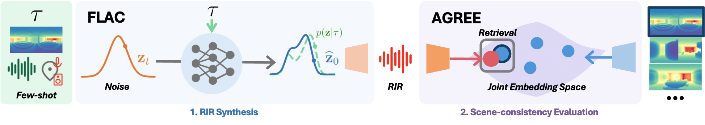

# Few-shot Acoustic Synthesis with Multimodal Flow Matching
Training and inference code for the paper "Few-shot Acoustic Synthesis with Multimodal Flow Matching", accepted at CVPR 2026.

<p align="center" style="margin: 2em auto;">
    <a href='https://amandinebtto.github.io/FLAC' style='padding-left: 0.5rem;'></a>
    <a href="https://huggingface.co/AmandineBtto/FLAC" target="_blank"></a>
    <a href="https://huggingface.co/AmandineBtto/AGREE" target="_blank"></a>
</p>


This repository includes:
- **FLAC**: our method for one-shot room impulse response generation.
- **AGREE**: a CLIP-style acoustic–geometry embedding model introduced for evaluating geometry-consistenty in RIR generation and enabling downstream tasks. 


## Method Overview



## Install
Clone this repository, navigate to the root, and run:
```bash
conda create -n flac python=3.10
conda activate flac
pip install .
```

**Hardware Requirements**
- Evaluation & Finetuning: All evaluation, HAA finetuning, and AGREE training can be performed on an RTX 4090 (24GB).
- FLAC Training: Training the VAE and the main FLAC model with EMA requires an H100 (80GB).
- Flash Attention: Requires PyTorch >= 2.5. We use version 2.7.4.post1. Refer to the [Flash Attention GitHub repo](https://github.com/Dao-AILab/flash-attention) for troubleshooting.


## Quick Start: Inference
To quickly generate RIRs and evaluate FLAC using pretrained weights
1. Download weights: run `bash download_weights.sh` in the repo root.
2. Download the [AcousticRooms dataset](https://github.com/facebookresearch/AcousticRooms).
3. Run:
```bash
python eval_FLAC.py \
--model-config src/configs/model_configs/FLAC/AR/FLAC_AR.json \
--dataset-config src/configs/dataset_configs/AR/eval/acousticroom_seeneval.json \
--ckpt-path weights/FLAC_EMA.ckpt \
--cfg-scale 1.0 \
--steps 1 \
--eval-name eval_FLAC \
--store-predictions True
```

## Global Repository Structure
```
.
├── AGREE/               # AGREE model & training (Run AGREE commands from here)
├── assets/              # README images
├── baselines/           # Baseline heuristics (KNN, etc.)
├── data/                # Dataset JSON splits and processing script (HAA)
├── src/                 # Core FLAC code
│   ├── configs/         # All .json configurations
│   ├── ...
├── weights/             # Model checkpoints (Download here)
├── download_weights.sh  # Script to download weights from Hugging Face
└── *.py                 # Main entry points (train.py, eval_*.py)
```

## Datasets Preparation

### AcousticRooms (AR)
Instructions for downloading the dataset are available [here](https://github.com/facebookresearch/AcousticRooms).

Unlike the original xRIR setup which trains separate models for evaluation on seen/unseen sets, we train a single model for evaluation on both. We modified the original split to ensure zero overlap between the training set and evaluation sets. Use the updated files in `data/AR/`.


### HAA
Download from [Zenodo](https://zenodo.org/records/11195833) the Hearing Anything Anywhere (HAA).

We only use the 'base' configurations for each of the four room categories (classroom, complex, dampened, hallway).
For each room, you only need `RIRs.npy` and `xyzs.npy`.

We provide depth maps at the source positions in: `data/HAA/depth`. Move these into your dataset directory so each room has a `depth_images/` subfolder (e.g., path/to/HAA/classroomBase/depth_images/classroomBase_depth_image.npy).
The depth maps were generated using the surface annotations available [here](https://github.com/maswang32/hearinganythinganywhere/tree/main/rooms). The process was: (i) create a mesh from the surface annotations; (ii) Render a panoramic depth map at each source position.

To convert the dataset into the required format (audio + poses), run the `prepare_data.py` script in `data/HAA`:
```bash
python prepare_data.py \
--dataset-path /path/to/HAA/dataset \
--output-dir /path/to/processed/HAA/dataset
```

For completeness, we provide the train/val/test split files used in our experiments in `data/HAA`, but they should be recreated by the `prepare_data.py` script.

## Weights
The weights for FLAC and AGREE can be downloaded from Hugging Face by running `download_weights.sh` in the repo root. Place the downloaded files in the `weights/` folder.


### Model Unwrapping
The checkpoint files created during training include the training wrapper, which greatly increases the size of the checkpoint file.
`unwrap_model.py` takes in a wrapped model checkpoint and saves a new checkpoint file including only the model itself.

That can be run with from the repo root with:
```bash
python unwrap_model.py \
--model-config /path/to/model/config 
--ckpt-path /path/to/wrapped/ckpt 
--name model_unwrap
--use-safetensors
```

## Training 

### FLAC
To start a training run on the AcousticRooms dataset, run the `train.py` script in the repo root with:
```bash
python train.py \ 
--dataset-config src/configs/dataset_configs/AR/train/acousticroom_train.json \
--val-dataset-config src/configs/dataset_configs/AR/eval/acousticroom_seeneval.json \
--val-every 2500 \
--checkpoint-every 2500 \
--batch-size 64 \
--num-workers 8 \
--model-config src/configs/model_configs/FLAC/AR/FLAC_AR.json \
--pretransform-ckpt-path weights/VAE.safetensors \
--save-dir ./outputs_FLAC \
--experiment-name FLAC_training \
--name FLAC
```

### VAE
The VAE takes multiple days on an H100. We provide a pretrained checkpoint (3.08M steps). To train from scratch:
```bash
python train.py \
--dataset-config src/configs/dataset_configs/AR/train/acousticroom_train.json \
--val-dataset-config src/configs/dataset_configs/AR/eval/acousticroom_seeneval.json \
--model-config src/configs/model_configs/VAE/VAE.json \
--batch-size 64 \
--num-workers 8 \
--val-every 10000 \
--save-dir ./outputs_VAE \
--name VAE \
--experiment-name VAE_training \
```
**Note**: Trained VAE checkpoints must be processed via `unwrap_model.py` before use in FLAC training.

### Finetuning on HAA
To finetune FLAC pretrained on AR on the HAA dataset, first change `max_steps` in `train.py` to 1000, then you can run:
```bash
python train.py \
--dataset-config src/configs/dataset_configs/HAA/train/haa_train.json \
--val-dataset-config src/configs/dataset_configs/HAA/eval/haa_val.json \
--model-config src/configs/model_configs/FLAC/HAA/FLAC_HAA_finetune.json \
--val-every 10 \
--checkpoint-every 10 \
--num-workers 8 \
--batch-size 16 \
--accum-batches 4 \
--name FLAC_HAA \
--pretransform-ckpt-path weights/VAE.safetensors \
--pretrained-ckpt-path weights/FLAC_EMA.ckpt \
```
Because the dataset is small, we accumulate gradients over 4 batches to increase the effective batch size.

**Performance Tip**: Removing the minus in `src/configs/dataset_configs/custom_metadata/HAA_md.py` (L70) improves acoustic metrics for HAA. This is consistent with the fact that the setup is reversed compared to AR (depth at the source position instead of the listener position). See the paper supplementary material for more details on this.

**Paper Metrics**: To obtain the metrics presented in the paper, we averaged over individual results per scene. The evaluation script also provides a mean over all the samples from all the scenes, which is different.

### FLAC Config Variants
We provide the config for different models from our paper. 
| Config File | Conditioning | Description |
| ----------- | ------------ | ----------- |
| `FLAC_AR.json` | AdaLN + Cross-Attn | Baseline. |
| `FLAC_AR_S.json` | AdaLN + Cross-Attn | Smaller DiT (Depth of 4). Similar performances. |
| `FLAC_AR_AllCA.json` | Cross-Attn| All conditioning via cross-attention. |
| `FLAC_AR_InContext.json` | Prepended | Conditioning prepended to input sequence. |
| `FLAC_AR_VAECtxt.json` | AdaLN + Cross-Attn | Uses VAE to encode context RIRs instead of ResNet18. Works with dataset config `acousticroom_train_VAECtxt.json`|
| `FLAC_AR_noGeom.json` | AdaLN + Cross-Attn | Evaluates FLAC without geometric conditioning (ablation).|


## Evaluation

### FLAC
Evaluate using either the standard script or the PyTorch Lightning wrapper:

```bash
# Standard script
python eval_FLAC.py \
--model-config /path/to/model/config \
--dataset-config /path/to/eval/dataset/config \
--cfg-scale 1.0 \
--steps 1 \
--eval-name eval_FLAC \
--ckpt-path /path/to/FLAC/ckpt \
--store-predictions False

# PyTorch Lightning wrapper
python eval_pl.py \ 
--model-config /path/to/model/config \ 
--val-dataset-config /path/to/eval/dataset/config  \
--cfg-scale 1.0 
--steps 1 
--name FLAC
--ckpt-path /path/to/FLAC/ckpt
--store-predictions False
```

**Reduced Acoustic Context**: To evaluate FLAC with a lower number of context RIRs, use the appropriate config files in `src/configs/dataset_configs`.

### Baselines
We provide a unified evaluation script that supports multiple baseline methods. The baselines serve as comparison points for learned generative models by using simple heuristics based on spatial proximity or random selection.

The following baseline methods are supported:
- RdnAcross: Randomly samples a RIR from the entire dataset. This baseline ignores all spatial information and serves as a lower bound on performance.
- RdnSame: Randomly samples a RIR from the same room/scene as the target. This baseline uses room identity but ignores the specific source-receiver positions.
- KNN: K-Nearest Neighbor approach that selects the reference RIR whose source position is closest to the target source position. This baseline uses explicit spatial reasoning with `--num-shot` reference examples.
- LinearInterp: Linear interpolation of multiple reference RIRs weighted by inverse distance to the target source position. Uses `--num-shot` reference examples and performs weighted interpolation in the waveform domain.

The `eval_baselines.py` script handles both AR and HAA datasets:

```bash
# AR (KNN 8-shot unseen evaluation)
python -m baselines.eval_baselines \
--dataset AR \
--baseline KNN \
--num-shot 8 \
--split unseen \
--data-path /path/to/AR/dataset \
--seen-json data/AR/seen_eval.json \
--ckpt-AGREE weights/AGREE/AGREE_fullAR.pt \
--output-dir baselines_results \

# HAA (RdnAcross test evaluation)
python -m baselines.eval_baselines \
--dataset HAA \
--baseline RdnAcross \
--split-file data/HAA/test_base.json \
--data-path /path/to/HAA_dataset \
--ckpt-AGREE weights/AGREE/AGREE_fullHAA.pt \
--out-dir baselines_results/
```


### VAE 
To eval the VAE:

```bash
python eval_VAE.py \
--model-config /path/to/model/config \
--dataset-config /path/to/eval/dataset/config \
--eval-name eval_VAE \
--ckpt-path /path/to/VAE/ckpt
```
**Note**: You need to give the `.ckpt` file in that case, not the `.safetensors` file.

## AGREE

### Training & Finetuning
To train AGREE on the AR dataset, run: 
```bash
cd AGREE
python -m AGREE_train.main \
--data-path /path/to/AcousticRooms/Dataset \
--folder-name single_channel_ir_1 \
--json-file-train-path ../data/AR/train.json \
--json-file-val-path ../data/AR/seen_eval.json \
--dataset-type AR \
--model dinoV3 \
--save-frequency 10 \
--report-to wandb  
--sample-size 10240 \
--sample-rate 22050 \
--warmup 10000 \
--batch-size 64 \
--workers=8 \
--lr=1e-4 \
--wd=0.1 \
--epochs=100 \   
--name AGREE_AR \ 
--precision amp 
```

For finetuning on HAA, run:
```bash
cd AGREE
python -m AGREE_train.main \
--data-path /path/to/HAA/Dataset \
--folder-name mono_rirs_22050Hz \
--json-file-train-path ../data/HAA/alldata_base.json \
--json-file-val-path ../data/HAA/val_base.json \
--dataset-type HAA \
--model dinoV3 \
--save-frequency 10 \
--report-to wandb  
--sample-size 10240 \
--sample-rate 22050 \
--warmup 10000 \
--batch-size 64 \
--workers=8 \
--lr=1e-4 \
--wd=0.1 \
--epochs=100 \   
--name AGREE_HAA \ 
--precision amp \
--pretrained /path/to/AGREE_AR/ckpt
```

We also provide the config files for using xRIR ViT or OpenCLIP ViT-S/16 instead of DINOv3 (see ablation in the paper's supplementary material).

We provide the AGREE checkpoints: 
- `AGREE_fullAR.pt` / `AGREE_fullHAA.pt`: Use these only for evaluation (FD/Recall metrics) as they have seen the full dataset.
- `AGREE_AR.pt`: Use this if you want to use AGREE as a pretrained backbone for further downstream tasks without data leakage.

### Evaluation
Run
```bash
python -m AGREE_train.main \
--data-path /path/to/AR/Dataset \
--json-file-val-path ../data/HAA/test_base.json \
--folder-name mono_rirs_22050Hz_librosa \
--dataset-type HAA \
--sample-size 10240 \
--sample-rate 22050 \
--batch-size 128 \
--workers=8 \
--model dinoV3 \
--precision amp \
--pretrained ../weights/AGREE_AR.pt
```

# Acknowledgements
Part of the code from this codebase is derived from [stable-audio-tools codebase](https://github.com/Stability-AI/stable-audio-tools) and from [open-clip](https://github.com/mlfoundations/open_clip). We thank the authors for making their code public and open-source, which greatly facilitated our work.

# Citation
If you find this code useful, please consider citing the paper:
```
@inproceedings{flac2026,
  title={Few-shot Acoustic Synthesis with Multimodal Flow Matching},
  author={Amandine Brunetto},
  booktitle={CVPR},
  year={2026}
}
```
